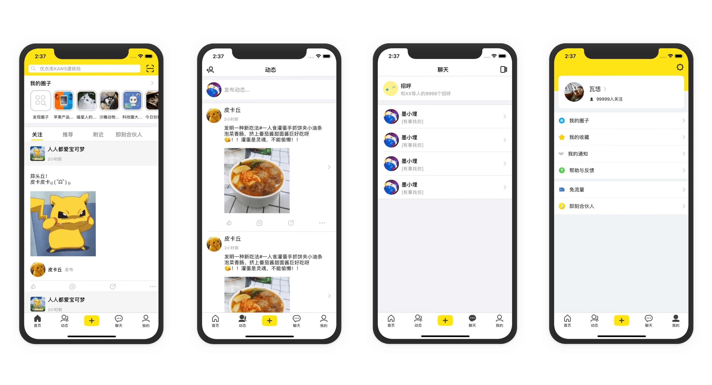

### SwiftUI_Jike

[中文版](README_CN.md)

`SwiftUI` is a common cross-platform framework for the Apple ecosystem, easy to get started, support for real-time previews, easy interface construction, and can be called with UIKit.

[**WWDC2019**](https://www.apple.com/ios/ios-13-preview/) has a lot of surprising techniques, such as SwiftUI,ARKit3. I learned SwiftUI by reading the official Apple documents, and then I spent some time to  make this demo.

### ScreenShot

### 💻 Requirements

- macOS 15 Beta
- Xcode 11.0 Beta
- iOS 13.0 Beta

[SwiftUI Official Document:](https://developer.apple.com/tutorials/swiftui)

## ✉️ Contacts

email : alphamiliPolo@gmail.com

即刻 : 墨小埋

## 📄 License

SwiftUI_Jike is released under the [MIT license](LICENSE). See LICENSE for details.
